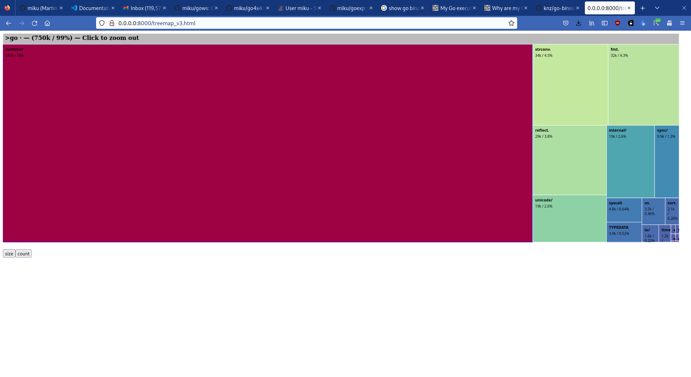

# Execution Model

* Go is compiled
* Every Go binary contains the Go runtime



A few compiler options:

* `CGO_ENABLED` - default 1, disabled when cross-compiling

## Cgo flag

```shell
$ cat curl.go
package main

import (
        "io"
        "log"
        "net/http"
        "os"
)

func main() {
        if len(os.Args) < 2 {
                log.Fatalf("usage: %s URL", os.Args[0])
        }
        resp, err := http.Get(os.Args[1])
        if err != nil {
                log.Fatal(err)
        }
        defer resp.Body.Close()
        if _, err := io.Copy(os.Stdout, resp.Body); err != nil {
                log.Fatal(err)
        }
}
```

With cgo, we get a dynamic executable:

```
$ CGO_ENABLED=1 go build -o curl curl.go
$ ldd curl
        linux-vdso.so.1 (0x00007ffd6a556000)
        libpthread.so.0 => /lib/x86_64-linux-gnu/libpthread.so.0 (0x00007fe29662b000)
        libc.so.6 => /lib/x86_64-linux-gnu/libc.so.6 (0x00007fe296403000)
        /lib64/ld-linux-x86-64.so.2 (0x00007fe29665c000)

$ CGO_ENABLED=0 go build -o curl curl.go
$ ldd curl
        not a dynamic executable
```

In the above: [vdso](https://man7.org/linux/man-pages/man7/vdso.7.html),
virtual dynamic shared object and a few other dependencies of indirect
dependencies (e.g. name resolution); cf.
[net.go](https://github.com/golang/go/blob/50664c236f9ab38cd57e0a36cf29527d4c513010/src/net/net.go#L39-L58).

You can use `CGO_ENABLED` or more fine-grained control (e.g. want pure go resolve, but include other cgo files):

```
$ go build -tags osusergo,netgo -o curl curl.go
$ ldd curl
        not a dynamic executable
```


## The go list command

Show the current import path (example: [zek](https://github.com/miku/zek))

```
$ go list
github.com/miku/zek
```

Show package name.

```shell
$ go list io
io
```

There is a wildcard stanza `...` (of used via `./...`) for specifying "package
and all subpackages" and it works with `go list`, too.

```
$ go list net/...
net
net/http
net/http/cgi
net/http/cookiejar
net/http/fcgi
net/http/httptest
net/http/httptrace
net/http/httputil
net/http/internal
net/http/internal/ascii
net/http/internal/testcert
net/http/pprof
net/internal/socktest
net/mail
net/netip
net/rpc
net/rpc/jsonrpc
net/smtp
net/textproto
net/url
```


Use `-f` to access internal package structure information, e.g. test files.

```shell
tir@trieste:~/code/miku/zek [git:master] $ go list -f '{{ .TestGoFiles }}'
[node_test.go stack_test.go structwriter_test.go]
```

## JSON output


```shell
$ go list -json ./backend/vault/ | jq -C . | less -r
{
  "Dir": "/home/tir/code/git.archive.org/martin/rclone/backend/vault",
  "ImportPath": "github.com/rclone/rclone/backend/vault",
  "Name": "vault",
  "Doc": "Package vault adds support for the Vault Digital Preservation System at Internet Archive.",
  "Root": "/home/tir/code/git.archive.org/martin/rclone",
  "Module": {
    "Path": "github.com/rclone/rclone",
    "Main": true,
    "Dir": "/home/tir/code/git.archive.org/martin/rclone",
```

## List dependencies

Listing dependencies and versions of a binary.

```shell
$ go version -m zek
zek: go1.19.2
        path    command-line-arguments
        dep     github.com/miku/zek     (devel)
        dep     github.com/sethgrid/pester      v1.2.0  h1:adC9RS29rRUef3rIKWPOuP1Jm3/MmB6ke+OhE5giENI=
        dep     golang.org/x/net        v0.1.0  h1:hZ/3BUoy5aId7sCpA/Tc5lt8DkFgdVS2onTpJsZ/fl0=
        dep     golang.org/x/text       v0.4.0  h1:BrVqGRd7+k1DiOgtnFvAkoQEWQvBc25ouMJM6429SFg=
        build   -compiler=gc
        build   -ldflags="-s -w"
        build   CGO_ENABLED=1
        build   CGO_CFLAGS=
        build   CGO_CPPFLAGS=
        build   CGO_CXXFLAGS=
        build   CGO_LDFLAGS=
        build   GOARCH=amd64
        build   GOOS=linux
        build   GOAMD64=v1
```

Also accessible via [runtime/debug](https://pkg.go.dev/runtime/debug#BuildInfo):

```shell
$ go run buildinfo.go
go      go1.19.2
path    command-line-arguments
build   -compiler=gc
build   CGO_ENABLED=1
build   CGO_CFLAGS=
build   CGO_CPPFLAGS=
build   CGO_CXXFLAGS=
build   CGO_LDFLAGS=
build   GOARCH=amd64
build   GOOS=linux
build   GOAMD64=v1
```
