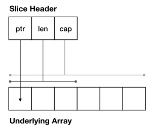

# Slices

* three values: pointer to storage array, length, capacity



* Slice tricks: https://github.com/golang/go/wiki/SliceTricks

## Relevant builtin functions

The builtin `append` can be used to append one element or a slice to an existing
slice. Builtin `copy` to duplicate a slice.

In summary:

* make, new -- [SliceMakeVsNew](Slices/SliceMakeVsNew/main.go)
* len
* cap
* append
* copy

> The zero value of a slice is `nil`. The `len` and `cap` functions will both return 0 for a nil slice.

Refs:

* [builtin](https://golang.org/pkg/builtin/)

## [A] From Slice to Array and back

> Q: How do you go from a slice to an array and back?

* [SliceStorage](Slices/SliceStorage/main.go)

## [A] Examples

> Q: What is happening?

```go
a := []int{1, 2, 3, 4, 5, 6, 7, 8, 9}
a = append(a[:2], a[7:]...)
```

* [SliceCut](Slices/SliceCut/main.go) 

### More examples

We can batch slices (also example for the reference nature of slices)

* [SliceBatching](Slices/SliceBatching/main.go)

A safe version of cut (deleting values).

* [SliceCutSafe](Slices/SliceCutSafe/main.go)

Similar idea, with deletions.

* [SliceDeleteSafe](Slices/SliceDeleteSafe/main.go)

### Safe slice ops in summary

1. reuse existing slice and copy values
2. set remaining values to nil
3. shrink slice

### Extend slices

Expanding a slice. The "double-appender".

* [SliceExpand](Slices/SliceExpand/main.go)

Extending a slice. Use "..." to extend a slice.

* [SliceExtend](Slices/SliceExtend/main.go)

Custom filters.

* [SliceFilter](Slices/SliceFilter/main.go)
* [SliceFilterNoAlloc](Slices/SliceFilterNoAlloc/main.go)


## Are the generic version of these functions?

> No, not yet. There might be in the future.

## [A] Slice Gotchas

> Q: What is happening in the following snippet.

* [SliceGotchaAppend](Slices/SliceGotchaAppend/main.go)
* [SliceGotchaAppendBytes](Slices/SliceGotchaAppendBytes/main.go)
