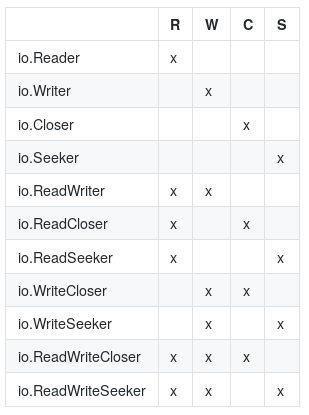
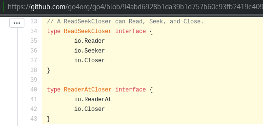
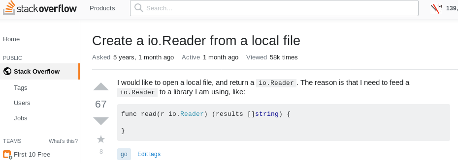
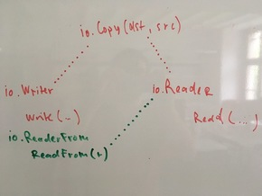

<!--
# Beautiful IO

> A tour through standard library pkg/io and various implementations of its interfaces.

[GOLAB 2019](https://golab.io), 2019–10–21, Florence
[Martin Czygan](mailto:martin.czygan@gmail.com)

<!-- Die Brautleute; short summaries at the beginning of the sections -->

----
<!--
# About me

SWE [@ubleipzig](https://ub.uni-leipzig.de).


* Leipzig University Library is involved in a variety of open source projects in
  the library domain: catalogs, repositories, digitization and image interop
  frameworks (IIIF), data acquisition, processing and indexing tools
* Go for tools and services
* Co-organizer of [Leipzig Gophers](https://golangleipzig.space)

> [Explore IO](https://github.com/miku/exploreio) workshop at Golab 2017.

----
-->

# Background

* Go Proverbs (2015)

> The bigger the interface, the weaker the abstraction.

Prominent examples are `io.Reader` and `io.Writer`.

----

# The IO package

* contains basic, widely used interfaces (within and outside standard library)
* utility functions

----

# Why beautiful?

> La bellezza è negli occhi di chi guarda

* small, versatile interfaces
* composable

----

# Praise and love

> This article aims to convince you to use io.Reader in your own code wherever
> you can. -- [@matryer](https://twitter.com/matryer)

> "Crossing Streams: a love letter to Go io.Reader" -- [@jmoiron](https://twitter.com/jmoiron)

> Which brings me to io.Reader, easily my favourite Go interface. --
> [@davecheney](https://twitter.com/davecheney)

----

# What's in pkg/io?

<!--
$ go doc io | grep ^type | wc -l
25
-->

* 25 types
* 21/25 are interfaces
* 12 functions, 3 constants, 6 errors

The concrete types are: `LimitedReader`, `PipeReader`, `PipeWriter`,
  `SectionReader`; functions: `Copy`, `CopyN`, `CopyBuffer`, `Pipe`,
  `ReadAtLeast`, `ReadFull`, `WriteString`, `LimitReader`, `MultiReader`,
  `TeeReader`, `NewSectionReader`, `MultiWriter`

----

# A few Interfaces




----

# Missing interfaces

You might find some missing pieces elsewhere (here:
[https://github.com/go4org/go4](https://github.com/go4org/go4)).



----

# How many readers, writers are there?

```shell
$ guru -json implements /usr/local/go/src/io/io.go:#3309,#3800
```

I counted over 200 implementations of each, io.Reader and io.Writer in the Go
tree and subrepositories.

----

# What is a Reader?

```go
type Reader interface {
        Read(p []byte) (n int, err error)
}
```

The reader implementation will populate a given byte slice.

* at most `len(p)` bytes are read
* to signal the end of a stream, return `io.EOF`

There is some flexibility around the end of a stream.

> Callers should always process the n > 0 bytes returned before considering the
error err. Doing so correctly handles I/O errors that happen after reading
some bytes and also both of the allowed EOF behaviors.

----

# Notes on Reader

```go
type Reader interface {
        Read(p []byte) (n int, err error)
}
```

* The byte slice is under the control of the caller.

> Implementations must not retain p.

This hints at the streaming nature of this interface.

----

# Notes on Reader

The `Read` function does not guarantee, the passed byte slice will by completely
filled. This is up to the implementation.

* `io.ReadAtLeast` -- will fail, if not at least a given number of bytes are read
* `io.ReadFull` -- special case; will fail, if the given byte slices is not completely filled

----

# Implementations

Readers can be:

* files
* network connections
* HTTP response bodies
* standard input
* compression
* serialization
* ...

Writers are use for hash functions, standard output, formatting, and more.

----

# Structural typing

* conversions are not required, a file implements `Read` and hence *is* a
  *io.Reader*



----

# Streams

As layed out in the *love letter*, the use of `ioutil.ReadAll` is not always the
answer. It's in the standard library and useful, but not always necessary.

```go
b, err := ioutil.ReadAll(r)
...
```

----

# Streams

* you may lose the advantage to use the `Reader` in other places
* you may consume more memory

> Streams can trivially produce infinite output while using barely any memory at
> all - imagine an implementation behaving like /dev/zero or /dev/urandom.

* Memory control is an important advantage.

----

# Follow the stream

Instead of writing:

```go
b, _ := ioutil.ReadAll(resp.Body) // Pressure on memory.
fmt.Println(string(b))
```

You may want to connect streams:

```go
_, _ = io.Copy(os.Stdout, resp.Body)
```

----

# Stream advantages

* memory efficient
* can work with data, that does not fit in memory
* allows to work on different protocol parts differently (e.g. HTTP header vs
  possibly large HTTP response body)

----

# Another example

Lots of data today comes in JSON, which we need to unmarshal.

```go
_ = json.Unmarshal(data, &v) // data might come from ioutil.ReadAll(resp.Body)
```

But we can decode it as well.

```go
_ = json.NewDecoder(resp.Body).Decode(&v)
```

In this case, the JSON data must be fully read, so this is a weak example.

----

# Glipse at composition

But what is we want need to preprocess the data, e.g. decompress it. Streams
compose well.

```go
zr, _ = gzip.NewReader(resp.Body)
_ json.NewDecoder(zr).Decode(&)
```

----

# How do you implement one yourself?

You only need a `Read` method with the correct signature.

* Example: `/dev/zero`

```go
type devZero struct{}

func (r *devZero) Read(p []byte) (int, error) {
        for i := 0; i < len(p); i++ {
                p[i] = '\x00'
        }
        return len(p), nil
}
```

This is already an infinite stream.

----

# Embed a reader

Often you want to transform a given data stream, so you embed it.

```go
type UpperReader struct {
	r io.Reader // Underlying stream
}

func (r *UpperReader) Read(p []byte) (int, error) {
	n, err := r.r.Read(p)
	copy(p, bytes.ToUpper(p))
	return n, err
}

func main() {
	if _, err := io.Copy(os.Stdout, &UpperReader{os.Stdin}); err != nil {
		log.Fatal(err)
	}
}
```

* Also try: https://tour.golang.org/methods/22 (Reader exercise, ROT13)

----

# The io.Writer interface

Analogous to the `io.Reader` interface.

```go
type Writer interface {
        Write(p []byte) (n int, err error)
}
```

> Write writes len(p) bytes from p to the underlying data stream. It returns the
> number of bytes written from p (0 <= n <= len(p)) and any error encountered
> that caused the write to stop early.

> Write must return a non-nil error if it returns n < len(p). Write must not
> modify the slice data, even temporarily.

As with readers:

> Implementations must not retain p.

----

# An example

A writer that does not much, but is still useful - `/dev/null` in Go:

```go
type devNull struct{}

func (w *devNull) Write(p []byte) (int, error) {
	return len(p), nil
}

func main() {
	if n, err := io.Copy(&devNull{}, strings.NewReader("Hello World")); err != nil {
		log.Fatal(err)
	} else {
		log.Printf("%d bytes copied", n)
	}
}
```

The standard library implementation is called `ioutil.Discard` (for an
interesting/frustrating bug related to ioutil.Discard, I recommend
[#4589](https://github.com/golang/go/issues/4589)).

----

# Use cases

Implementations may allow:

* to abstract a (physical) resource
* to convert something into a stream
* define buffers
* to enhance functionality - decorate, transform
* mock behaviour (testing)
* to be used as utilities

----

# Resource: os.File

Prototypical stream: A file.

* os.File

And alternatives and substitutions, e.g. dummy files for tests or file that
support atomic writes.

----

# Historical note


> A file is simply a sequence of bytes. Its main attribute is its size. By
> contrast, on more conventional systems, a file has a dozen or so attributes.
> To specify and create a file it takes endless amount of chit-chat. If you are
> on a UNIX system you can simply ask for a file and use it interchangeble
> whereever you want a file. -- (https://www.youtube.com/watch?v=tc4ROCJYbm0, 1982)

If a file is just a sequence of bytes, more things will look like files.

----

# Resource: net.Conn

> Conn is a generic stream-oriented network connection.

```go
type Conn interface {
        // Read reads data from the connection.
        // Read can be made to time out and return an Error with Timeout() == true
        // after a fixed time limit; see SetDeadline and SetReadDeadline.
        Read(b []byte) (n int, err error)
        ...
        // Write writes data to the connection.
        // Write can be made to time out and return an Error with Timeout() == true
        // after a fixed time limit; see SetDeadline and SetWriteDeadline.
        Write(b []byte) (n int, err error)
        ...
```

----

# Example HTTP GET

```go
conn, _ := net.Dial("tcp", "golang.org:80")
_, _ = io.WriteString(conn, "GET / HTTP/1.0\r\n\r\n")
```

----

# Conversion: strings

Turing strings and byte slices into streams.

```go
r := strings.NewReader("might help testing")
// r := bytes.NewReader([]byte("might help testing"))
```

----

# Buffers: bytes.Buffer

> A Buffer is a variable-sized buffer of bytes with Read and Write methods. The
> zero value for Buffer is an empty buffer ready to use.

The byte slice of the streaming world.

```go
var buf bytes.Buffer
_, _ = io.WriteString(&buf, "data")
// buf.String()
// buf.Bytes()
```

----

# Enhancement: bufio.Reader

> Package bufio implements buffered I/O. It wraps an io.Reader or io.Writer
> object, creating another object (Reader or Writer) that also implements the
> interface but provides buffering and some help for textual I/O.

```go
// Reader implements buffering for an io.Reader object.
type Reader struct {
	buf          []byte
	rd           io.Reader // reader provided by the client
	r, w         int       // buf read and write positions
	err          error
	lastByte     int // last byte read for UnreadByte; -1 means invalid
	lastRuneSize int // size of last rune read for UnreadRune; -1 means invalid
}
```

----

# Enhancement: bufio.Reader

Provides simplifications, e.g. to read up to given delimiters, e.g. linewise
reads.

A further abstraction, `bufio.Scanner` is built from a reader, which allows to
process a stream, by splitting into a sequence of tokens.

----

# Enhancement: tabwriter.Writer

> A Writer is a filter that inserts padding around tab-delimited columns in its
> input to align them in the output.

> The Writer treats incoming bytes as UTF-8-encoded text consisting of cells
> terminated by horizontal ('\t') or vertical ('\v') tabs, and newline ('\n') or
> formfeed ('\f') characters; both newline and formfeed act as line breaks.

```
8543296|0
6353501|65535
   1346|5140
    881|21588
```

----

# Transformation: compress/gzip

```go
data := []byte{
        0x1f, 0x8b, 0x08, 0x00, 0xfc, 0x27, 0xac, 0x5d,
        0x00, 0x03, 0x4b, 0xcf, 0xcf, 0x49, 0x4c, 0xe2,
        0x02, 0x00, 0x4a, 0x77, 0xaa, 0x30, 0x06, 0x00,
        0x00, 0x00,
} // echo golab | gzip -c | xxd -i
gzr, _ := gzip.NewReader(bytes.NewReader(data))
if _, err := io.Copy(os.Stdout, gzr); err != nil {
        log.Fatal(err)
}
```

As I like [pigz](https://zlib.net/pigz/), I'm a fan of these drop-in compression
implementations as well:

* [https://github.com/klauspost/compress](https://github.com/klauspost/compress)

----

# Transformation: Serialization

Many subpackages of package encoding provide encoders and decoders for working
with streams, e.g. json, xml, gob, base64.

```go
// base64.NewDecoder
func NewDecoder(enc *Encoding, r io.Reader) io.Reader
```

```go
_ = json.NewEncoder(os.Stdout).Encode(value)
```

----

# Transformation: Blackout

Stranger implementation. A blackout reader that blacks out occurences of certain
words.

Example: x/blackout


----

# Mock implementations

Implementations of readers and writers for test purposes.

* simulate failure cases
* infinite stream

----

# Mock: Infinite reader

```
// infiniteReader satisfies Read requests as if the contents of buf
// loop indefinitely.
type infiniteReader struct {
        buf    []byte
        offset int
}

func (r *infiniteReader) Read(b []byte) (int, error) {
        n := copy(b, r.buf[r.offset:])
        r.offset = (r.offset + n) % len(r.buf)
        return n, nil
}
```

----

# Mock: Slow reader

Insert delays into read operations.

* Example: x/slowreader
* [Asciicast](https://raw.githubusercontent.com/miku/exploreio/wip/casts/cowmf6c23w1prceotyf54lt19.gif)

----

# Test case reader examples

* bufio_test.slowReader
* bufio_test.errorThenGoodReader
* bufio_test.rot13Reader
* encoding/base64.faultInjectReader

Example from k8s (how do implementations handle slow responses):

```go
type readDelayer struct {
        delay time.Duration
        io.ReadCloser
}

func (b *readDelayer) Read(p []byte) (n int, err error) {
        defer time.Sleep(b.delay)
        return b.ReadCloser.Read(p)
}
```

----

# Utilities

Utility implementations and helper functions.

* Side effects: count total bytes read or written
* Patterns: encoding/csv.nTimes
* Sink: ioutil.Discard
* Source: infinite data
* Limits: timeout Reader
* Error handling: stickyErrWriter
* Split stream: TeeReader
* Merge streams: MultiReader

----

# Utility: Counting

An identity transform, with a side effect, e.g. counting.

```go
type CountReader struct {
	count int64
	r     io.Reader
}

func (r *CountReader) Read(buf []byte) (int, error) {
	n, err := r.r.Read(buf)
	atomic.AddInt64(&r.count, int64(n))
	return n, err
}

func (r *CountReader) Count() int64 {
	return atomic.LoadInt64(&r.count)
}
```

Again: it would be simple to take the length of a byte slice, a stream is more
memory efficient. Other stats are possible.

----

# Utility: Language Guesser

Guess language of stream with a trigram.

* Example: x/trigram

----

# Utility: Source

From: encoding/csv/reader_test.go

```go
// nTimes is an io.Reader which yields the string s n times.
type nTimes struct {
        s   string
        n   int
        off int
}
```

It is used to generate testdata to benchmark the csv implementation.

```go
...
r := NewReader(&nTimes{s: rows, n: b.N})
...
```

----

# Utility: Source

Generate infinite data with finite resources.

* zeros
* random data

Example: x/randbase

----

# Utility: Timeout

Encapsulate a timeout in a read operation.

Example: x/timeout

----

# Utility: TeeReader

The `io.TeeReader` function allows to duplicate a stream.

```go
r := strings.NewReader("some io.Reader stream to be read\n")
var buf bytes.Buffer
tee := io.TeeReader(r, &buf)
```

----

# Utility: MultiReader

```go
rs := []io.Reader{
        strings.NewReader("Hello\n"),
        strings.NewReader("Gopher\n"),
        strings.NewReader("World\n"),
        strings.NewReader("!\n"),
}
r := io.MultiReader(rs...)
if _, err := io.Copy(os.Stdout, r); err != nil {
        log.Fatal(err)
}
```

Possible use cases: Unify multiples of the same thing (e.g. data chunked into
files) or a variety of different things, e.g. strings, files and remote
resources.

----

# Utility: Duplicating a ReadCloser

A response body is a `io.ReadCloser` and can be read only once.

Example: x/duprc

----

# Utility: Attach an event to a reader

```go
type onEOFreader struct {
	r io.Reader
	f func()
}

func (r *onEOFreader) Read(p []byte) (n int, err error) {
	n, err = r.r.Read(p)
	if err == io.EOF {
		r.f()
	}
	return n, err
}

func main() {
	r := onEOFreader{r: os.Stdin, f: func() {
		log.Printf("done reading")
	}}
	_, _ := io.Copy(os.Stdout, &r)
}
```

----

# Utility: stickyErrWriter

Stolen from [Hacking with Andrew and Brad](https://www.youtube.com/watch?v=yG-UaBJXZ80).

* Use case: Implement a writer, where an error sticks around across multiple write calls.

```go

// stickyErrWriter keeps an error around, so you can *occasionally* check if an error occured.
type stickyErrWriter struct {
	w   io.Writer
	err *error
}

func (sew stickyErrWriter) Write(p []byte) (n int, err error) {
	if *sew.err != nil {
		return 0, *sew.err
	}
	n, err = sew.w.Write(p)
	*sew.err = err
	return
}
```

----

# Copy

We used `io.Copy` all along.

> Copy copies from src to dst until either EOF is reached on src or an error
> occurs. It returns the number of bytes copied and the first error encountered
> while copying, if any.

It uses an internal buffer (of size 32k) to move data from reader to writer.

----

# Copy Optimizations

If the source (a reader) has a `WriteTo(w io.Writer)` methods, or the
destination (a writer) has a `ReadFrom(r io.Reader)` method (implements
`io.ReadFrom`), then `io.Copy` does not need to use its internal buffer.



----

# Wrap up

* stream interfaces are very versatile
* you will mostly need to implement a single method
* allows to you adopt to a large number of existing components

----

# Thanks
